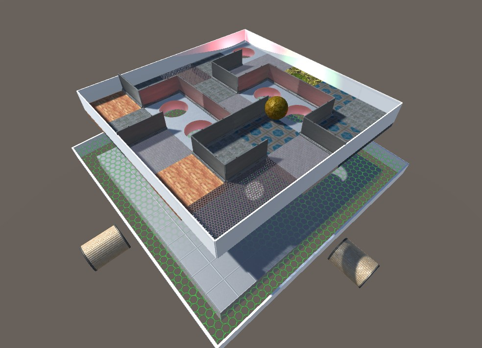

# MAZE-Game-Unity

Unity-Version: 2020.1.6f1 

As part of my master studies in the first semester at the HTW Berlin - University of Applied Sciences, I developed a maze game with Unity3D in winter 2020/2021. 
<i>Sample Scene, materials and prefabs provided by my professor PhD David Strippgen</i>.

My part was to implement the <b>Recursive-backtracker Algorithm</b>.
 
## How Recursive-backtracker Algorithm works ( - Wikipedia):

<i>The depth-first search algorithm of maze generation is frequently implemented using backtracking.  
This can be described with a following recursive routine:

1. Given a current cell as a parameter
2. Mark the current cell as visited
3. While the current cell has any unvisited neighbour cells
4. Choose one of the unvisited neighbours
5. Remove the wall between the current cell and the chosen cell
6. Invoke the routine recursively for a chosen cell

which is invoked once for any initial cell in the area.</i>
  

The size of the field can be changed dynamically.  
Whether 4x4, 2x2, 1x5, 10,10,.. everything is possible. 
To get the ball moving, you can move the field with the arrow keys. 

    
    
    
    
    
    
    
    
    
    
    
    
    
    

